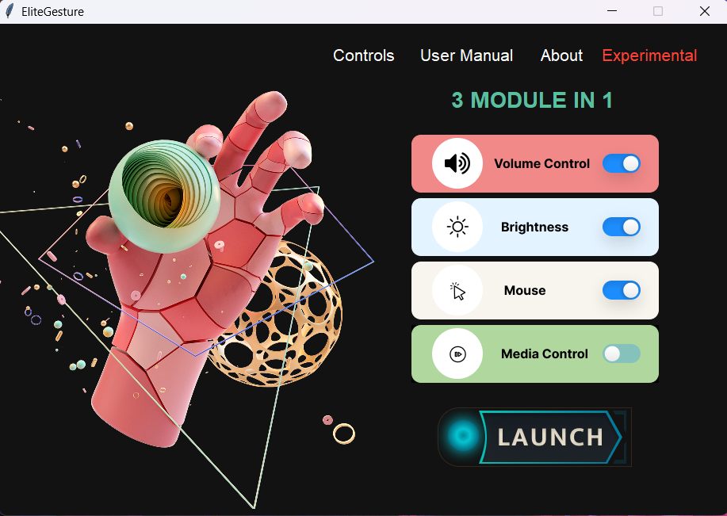

# Hand-Gestuere-Control-System

Hand gesture recognition system refers to the movement of the hand while a gesture refers to any certain movement of the hands, arms, or any movement of anything. Hand gestures are an issue of frame language that may be conveyed thru the center of the palm, the finger role and the form constructed by way of the hand. Hand gestures may be categorized into static and dynamic. As its call implies, the static gesture refers back to the stable form of the hand as shown in determine 1, while the dynamic gesture comprises a chain of hand actions along with waving. Collection of the hand gestures is done from the webcam of a PC, or any external camera connected to a device and with different machine learning algorithm for implementation of the project in the real-life environment. Gesture recognition can be the way for the computer and Robot to understand the human interaction and perform different operation as authorized by the program. It can be used to operate different machineries, robots, computers etc. The gestures asked is converted into commands to the device through the computer vision. Hand gestures offer an inspiring field of research because they can facilitate communication and provide a natural means of interaction that can be used across a variety of applications. The crucial aim of constructing hand gesture recognition gadget is to create an herbal interaction among human and computers in which the diagnosed gestures may be used for controlling a robot or conveying meaningful information. Gestures can be static (posture or sure pose) which require less computational complexity or dynamic (series of postures) which are greater complex however appropriate for actual time surroundings.
  
Link for the paper: <a href="https://www.linkedin.com/safety/go?url=https%3A%2F%2Flink.springer.com%2Fchapter%2F10.1007%2F978-981-99-7622-5_40&trk=flagship-messaging-web&messageThreadUrn=urn%3Ali%3AmessagingThread%3A2-ZmYwOTRlMDQtZmNjMS00NDU2LWFhNjgtMjFjNGI0NmI1NjEzXzAxMA%3D%3D&lipi=urn%3Ali%3Apage%3Ad_flagship3_detail_base%3BFhHpc07YR4yF8p1HEKFzTw%3D%3D">Springer</a>
<h1>Features Controlled</h1> 
<ul>
  <li>Volume</li>
  <li>Brightness</li>
  <li>Mouse</li>
  <li>Media</li>
  <li>Three In One</li>
</ul> 

<h1>GUI Interface</h1> 
<h2> Home Interface</h2>

  
<h2> User Manual Interface</h2>

  
<h2> About Interface</h2>

<h2> Experimental Interface</h2>

